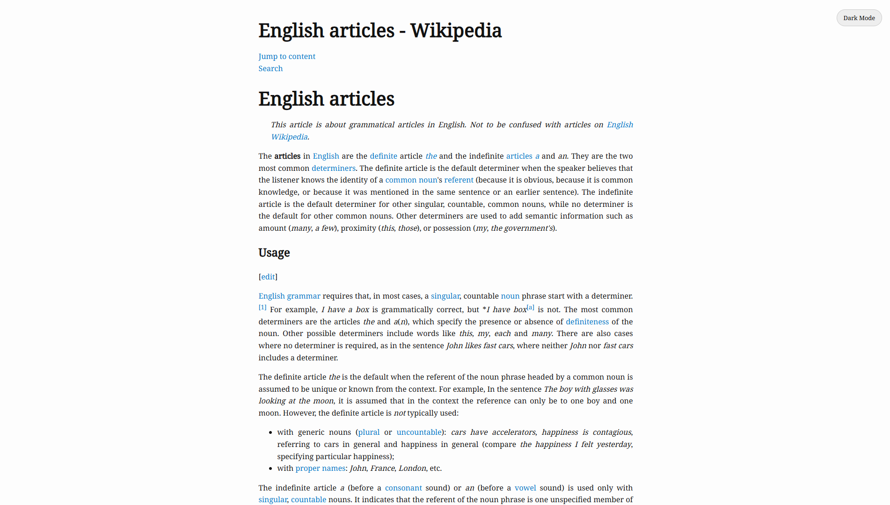

# 📰 Reader Mode by Kushagra Singh

Reader Mode is a clean and distraction-free Chrome Extension that extracts the main content from webpages (like Safari's reading mode) using Mozilla’s Readability library and displays it in a beautifully styled interface with dark mode enabled by default.

## 🔧 Features

- ✨ Extracts article content from any webpage
- 🎨 Clean and minimal interface with **Noto Serif** typography
- 🌙 Dark Mode with toggle support

## 📸 Preview

---

## 🚀 How to Install

1. Clone this repository or [Download ZIP](https://github.com/kushagrasinghx/reader-mode/archive/refs/heads/main.zip)
2. Go to `chrome://extensions/`
3. Enable **Developer Mode** (top right)
4. Click **"Load unpacked"** and select the folder where you cloned/unzipped the extension.

---

## 🛠 How it Works

- When you click the extension icon, the content script extracts the page's article using Readability.
- It then opens a new tab with `reader.html` and displays the content in a minimal layout.
- The layout applies has a clean look and strips away any visual clutter.

---

## 🚫 Automatically Removes

- Navbar
- Footer
- Search boxes / input fields
- Buttons
- Images

## 📦 File Structure

reader-mode/
├── background.js       # Handles extension activation  
├── contentScript.js    # Extracts readable content using Readability  
├── readability.js      # Local version of Mozilla Readability  
├── reader.html         # Clean layout for reading  
├── reader.js           # Renders title and content to page  
├── reader.css          # Typography, dark mode, and layout styling  
├── manifest.json       # Chrome Extension configuration  
├── icon.png            # Extension icon  
└── README.md           # You're here :)

---

## 📌 Roadmap / To-Do

- [x] Dark mode support  
- [x] Toggle for light/dark mode  
- [ ] Support for saving articles offline  
- [ ] Improve content detection on dynamic sites  
- [ ] AI summary for the text

---

## ✍️ Author

Made with ❤️ by [Kushagra Singh](https://github.com/kushagrasinghx)

---

## 📄 License

MIT License - free to use, modify, and share.